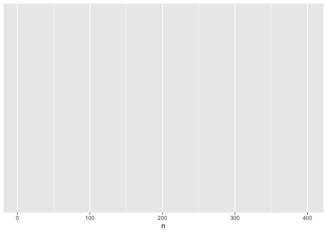
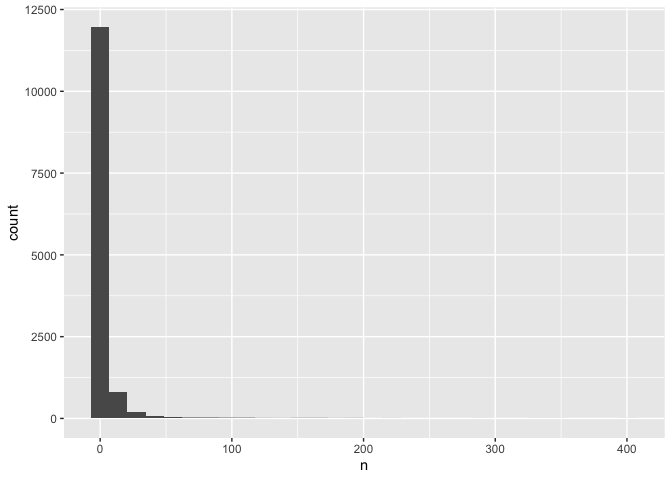
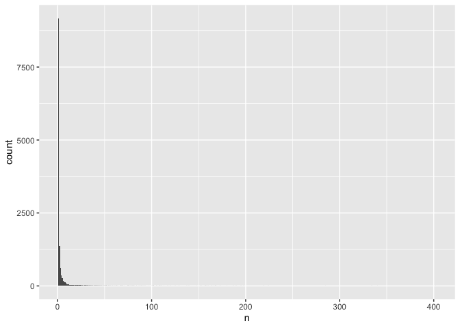
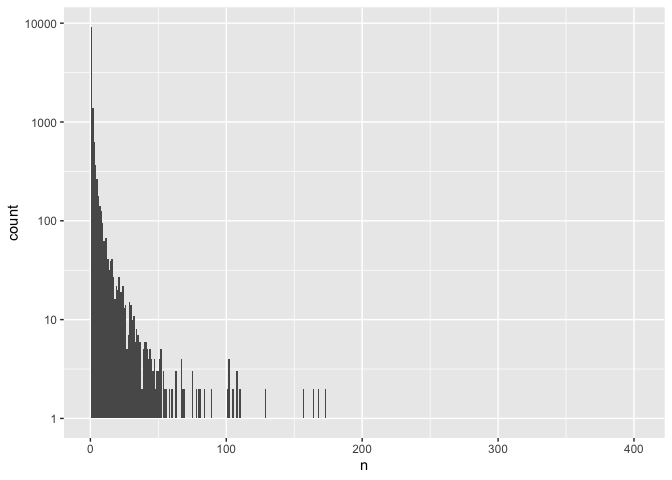
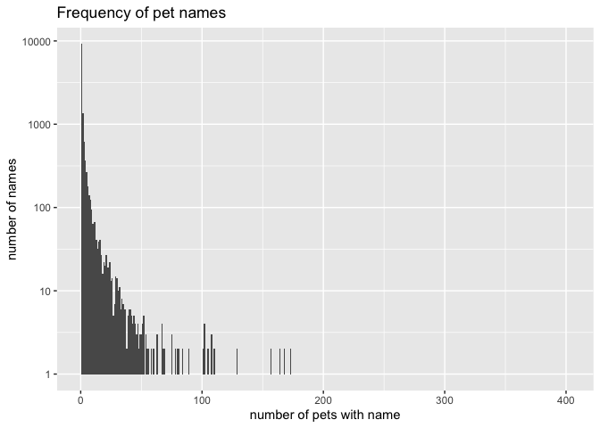
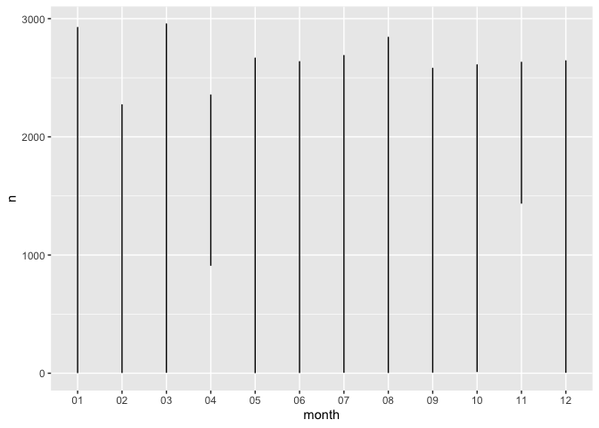
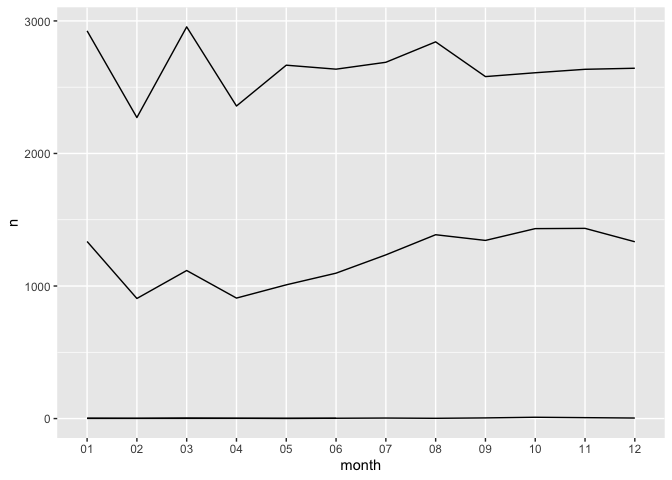
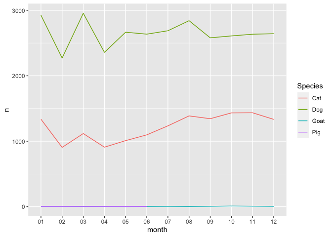
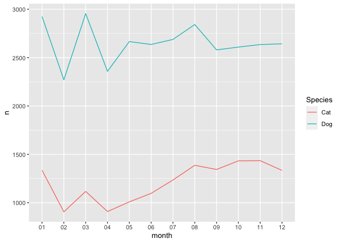

Introduction to R: Seattle pet names
================

<!--This markdown file is generated from the R markdown file with the same prefix. Please edit that file. -->

**Description**: New to R statistical programming? Join this
introductory R workshop in a whirlwind tour of R for data manipulation
and visualization! We’ll apply widely used tools from the Tidyverse
collection of packages in the RStudio interface to jumpstart your data
science work using R. This material is intended to be covered by a
two-hour instructor-led class.

## Introduction

This course introduces R coding from a data science perspective, and is
designed around the step-by-step process of analyzing a dataset.

By the end of this class, you should be able to:

-   recognize important features of R coding syntax
-   import, inspect, and manipulate spreadsheet-style data
-   create publication-quality visualizations of data
-   organize R coding within projects for reproducibility

This workshop is not intended to teach you everything you need to know
to analyze your own data in R, but instead, should give you an idea of
how R coding works and the basic ways that R coders go about developing
a project.

## Getting started

[R](https://cran.r-project.org) is a statistical programming language,
while [RStudio](https://rstudio.com) is an integrated development
environment (IDE) that allows you to code in R more easily.

The left side of RStudio is the console, where you can run R code. The
text printed in this panel is basic information about R and the version
you’re running. You can test how the console can be used to run code by
entering `3 + 4` and then pressing enter. This instructs your computer
to read, interpret, and execute the command, then print the result (`7`)
to the Console, and show a right facing arrow (`>`), indicating it is
ready to accept additional code.

You can run code by typing into the Console, then hitting enter:

``` r
4 + 5 
```

    ## [1] 9

The panel on the lower right shows the files present in your working
directory. Currently, that’s probably your `Home` directory, which
includes folders like `Documents` and `Downloads`.

Before we continue coding, we need to do a few more things to make it
easier for us to work in R. First, we’ll create a new project to use for
this workshop:

-   `File -> New Project`
-   Choose `New Directory`, then `New Project`
-   name your project `intro_r` and save it somewhere on your computer
    you’ll be able to find easily later (we recommend your Desktop or
    Documents)
-   Click `Create project`

After your RStudio screen reloads, note two things:

-   The file browser in the lower right panel will now show the contents
    of a new folder, `intro_r`, that was created as a part of your
    RStudio project.
-   The console window will show the path, or location in your computer,
    for your project directory. This is important later in class, when
    this path will be required to locate data for analysis.

Now we’re ready to create a new R script:

-   `File -> New File -> R Script`
-   Save the new file as `pet_names.R`. By default, RStudio will save
    this in your project directory.

This R script is a text file that we’ll use to save code we write in
this workshop. We’ll refer to this window as the script or source
window. Remember to save this file periodically to retain the record of
the work you’re doing, so you can re-execute the code later if
necessary.

By convention, a script should include a title at the top. Then we’ll
load the packages we’ll be using.

``` r
# Introduction to R

# load packages
library(tidyverse)
```

    ## ── Attaching packages ─────────────────────────────────────── tidyverse 1.3.1 ──

    ## ✓ ggplot2 3.3.3     ✓ purrr   0.3.4
    ## ✓ tibble  3.1.2     ✓ dplyr   1.0.6
    ## ✓ tidyr   1.1.3     ✓ stringr 1.4.0
    ## ✓ readr   1.4.0     ✓ forcats 0.5.1

    ## ── Conflicts ────────────────────────────────────────── tidyverse_conflicts() ──
    ## x dplyr::filter() masks stats::filter()
    ## x dplyr::lag()    masks stats::lag()

Loading packages is like opening an application: it makes a previously
installed software available and ready to use.

A line of code starting with `#` is a code comment: this means it’s
readable by and useful to humans, but R will ignore anything that comes
after `#`. We’ve included a comment as a title, as well as one
describing what the code `library(tidyverse)` means.

`library` is a function, which tell the computer how to perform
particular tasks for you. In this case, `library` has instructed R to
ensure functions from packages in Tidyverse will be readily accessible.

We’ve added this code to our script. If we wanted to execute (tell R to
run) this command, we have options:

1.  Copy and paste the code into the Console
2.  Use the `Run` button at the top of the script window
3.  Use the keyboard shortcut: `Ctrl + Enter`

The third option is the most efficient, especially as your coding skills
progress. With your cursor on the line with the code, hold down the
`Control` key and press `Enter`. You’ll see the code and answer both
appear in the Console. A few things to note about this keyboard
shortcut:

-   It doesn’t matter where your cursor is on the line of code; the
    entire line will be executed with the keyboard shortcut.
-   If there isn’t code on the line where your cursor is located,
    RStudio will attempt to execute following lines.

In practice, a script should represent code you are developing in R, and
you should only save the code that you know actually works. This makes
it easier to re-create your analysis later. For this class, we’ll be
including notes about things we learn as comments.

## Importing data

Now that our project and software are available and loaded, we can
obtain the data we’ll be using in this workshop.

In the code below:

-   `read_csv` is a function from Tidyverse that imports
    spreadsheet-style data into R. As with other R functions, the
    parentheses contain the arguments, or information about how the
    function should run.
-   Quotation marks enclose the url from which we are obtaining the data
    (a csv file).
-   `<-` is the assignment operator; it instructs R to recognize `pets`
    as representing our table of data imported from the csv file.
-   `pets` is we are calling the object representing the data. Objects
    allow us easier ways to reference data (or collections of data); you
    can think of them like variables in math.

You can think of this code in its entirety as referencing “the
spreadsheet goes into pets.”

``` r
# import data and assign to object
pets <- read_csv("https://data.seattle.gov/api/views/jguv-t9rb/rows.csv")
```

    ## 
    ## ── Column specification ────────────────────────────────────────────────────────
    ## cols(
    ##   `License Issue Date` = col_character(),
    ##   `License Number` = col_character(),
    ##   `Animal's Name` = col_character(),
    ##   Species = col_character(),
    ##   `Primary Breed` = col_character(),
    ##   `Secondary Breed` = col_character(),
    ##   `ZIP Code` = col_double()
    ## )

After executing the code above (by holding the `Control` key and
pressing `Enter`), you will see:

-   Console: summary of the data, including each column name and the
    type of data included. `character` refers to data including
    letters/words (sometimes referred to as string data in other
    languages). `double` refers to numerical data.
-   Environment pane: upper right hand side of the RStudio screen, lists
    the name of object (`pets`) on the left, and the dimensions of the
    data (spreadsheet) assigned to it previewed on the right. These data
    are arranged in a tidy format, meaning each row represents an
    observation (`obs.`), and each column represents a variable (piece
    of data for each observation). Moreover, only one piece of data is
    entered in each cell.

Now that the object has been assigned, we can inspect the object and
learn a bit more about what the data represents.

If you click on `pets` in the environment pane, a new tab will appear
next to your R script in the Source pane so you can preview the data: -
These data include pet names obtained from from [City of Seattle pet
licenses](https://data.seattle.gov/Community/Seattle-Pet-Licenses/jguv-t9rb).
- Each row represents a pet, and each column represents information
about the pet, like issue data of the license, name, and breed. R refers
to this type of data organization (e.g., spreadsheet-style) as a data
frame. Tidyverse uses a specialized type of data frame called a tibble
(`tbl`). For our purposes, we’ll use these terms interchangeably.

> In this case, we are not retaining a copy of the data on our computer
> (though we have loaded the data into our working memory).
> Additionally, we are importing data from a csv, or comma separated
> value, file. You may need to make different choices in telling R how
> to import your data; some additional options commonly encountered are
> available
> [here](https://rstudio-education.github.io/tidyverse-cookbook/import.html).

## Exploring the data

Let’s assume we’re interested in answering the following questions using
these data:

-   Can I find my dog in this dataset?
-   Where do goats live?
-   What are the most common pet names in the dataset?
-   What are the weirdest pet names in the dataset?
-   In which months are pets adopted most often?

Let’s get started by learning a few more useful ways to look at our
data, which will be useful as we figure out how to ask and answer our
questions.

First, if we want to take a peek at our data again:

``` r
glimpse(pets)
```

    ## Rows: 46,388
    ## Columns: 7
    ## $ `License Issue Date` <chr> "December 18 2015", "June 14 2016", "June 16 2016…
    ## $ `License Number`     <chr> "S107948", "S116503", "S116742", "S119301", "2085…
    ## $ `Animal's Name`      <chr> "Zen", "Misty", "Frankie Lee Jones", "Lyra", "Puc…
    ## $ Species              <chr> "Cat", "Cat", "Cat", "Cat", "Cat", "Cat", "Cat", …
    ## $ `Primary Breed`      <chr> "Domestic Longhair", "Siberian", "Domestic Shorth…
    ## $ `Secondary Breed`    <chr> "Mix", NA, NA, NA, NA, NA, NA, NA, NA, NA, NA, NA…
    ## $ `ZIP Code`           <dbl> 98117, 98117, NA, 98121, 98107, 98146, 98108, 981…

A few observations about these data: - most of the columns are
straightforward to understand - we may need to convert the type of data
(e.g., `chr` or `dbl`) depending on our questions - column names with
spaces in them are encased in back ticks - NA indicates missing data

Next, let’s learn to use some functions to manipulate the data a bit
more. We can count the number of each species, which will also tell us
how many species there are:

``` r
# count number of each species 
count(pets, Species)
```

    ## # A tibble: 4 x 2
    ##   Species     n
    ##   <chr>   <int>
    ## 1 Cat     14542
    ## 2 Dog     31808
    ## 3 Goat       35
    ## 4 Pig         3

This function accepts two arguments: the name of the dataset (`pets`)
and the column we would like to assess (`Species`). It returns a table
with two columns, one indicating the name of each species, and the other
(`n`) representing the number of rows in the original dataset for each
species. Since there are relatively few examples of goats and pigs in
the dataset, we may need to remove those later.

Next, let’s take a look at our zip codes. Because these were interpreted
by R as numerical data, we can use a regular function from math to
assess their range:

``` r
range(pets$`ZIP Code`)
```

    ## [1] NA NA

The `$` is a special character that allows us to access a particular
column in the data frame.

Since there are missing data in the dataset, we get a very unsatisfying
answer. We can add an additional argument to ignore the missing data:

``` r
range(pets$`ZIP Code`, na.rm = TRUE)
```

    ## [1]   981 99810

Oops, looks like there’s at least one piece of data that has been
entered incorrectly (an incomplete zip code). We’ll keep that in mind
for some of our later explorations.

Now that we have a better idea of some of the nuances of the data, let’s
start to address some questions.

## Can I find my dog in this dataset?

I adopted my dog Loki last September, which the website from which I
pulled the data source indicated is included. I can look for any animal
with the name Loki using another function from tidyverse:

``` r
filter(pets, `Animal's Name` == "Loki")
```

    ## # A tibble: 117 x 7
    ##    `License Issue Da… `License Number` `Animal's Name` Species `Primary Breed`  
    ##    <chr>              <chr>            <chr>           <chr>   <chr>            
    ##  1 April 10 2019      142748           Loki            Cat     Domestic Medium …
    ##  2 April 23 2019      8007463          Loki            Cat     Mix              
    ##  3 May 11 2019        8007924          Loki            Cat     Domestic Longhair
    ##  4 June 11 2019       349964           Loki            Cat     Pixie-Bob        
    ##  5 June 28 2019       S150592          Loki            Cat     Domestic Shortha…
    ##  6 July 20 2019       434474           Loki            Cat     Pixie-Bob        
    ##  7 August 04 2019     8010346          Loki            Cat     Domestic Shortha…
    ##  8 August 05 2019     S133431          Loki            Cat     Domestic Shortha…
    ##  9 August 07 2019     577887           Loki            Cat     Domestic Shortha…
    ## 10 August 21 2019     S136205          Loki            Cat     Domestic Shortha…
    ## # … with 107 more rows, and 2 more variables: Secondary Breed <chr>,
    ## #   ZIP Code <dbl>

The syntax, or way of representing R code with words and symbols, is
similar here to other functions we’ve run. We are asking R to show us
any rows for which the pet name (from the Animal’s Name column) is
exactly (`==`) Loki. We have to include the name in quotation marks so R
doesn’t interpret it as an object or column name.

It looks like there are a lot of pets named Loki! We could assign that
output to a new object, then apply another filter to the new object.
Instead, we’re going to learn a tool that will help us build more
complex sets of data manipulation steps.

The following code results in the same output as the last code we ran:

``` r
pets %>%
  filter(`Animal's Name` == "Loki")
```

    ## # A tibble: 117 x 7
    ##    `License Issue Da… `License Number` `Animal's Name` Species `Primary Breed`  
    ##    <chr>              <chr>            <chr>           <chr>   <chr>            
    ##  1 April 10 2019      142748           Loki            Cat     Domestic Medium …
    ##  2 April 23 2019      8007463          Loki            Cat     Mix              
    ##  3 May 11 2019        8007924          Loki            Cat     Domestic Longhair
    ##  4 June 11 2019       349964           Loki            Cat     Pixie-Bob        
    ##  5 June 28 2019       S150592          Loki            Cat     Domestic Shortha…
    ##  6 July 20 2019       434474           Loki            Cat     Pixie-Bob        
    ##  7 August 04 2019     8010346          Loki            Cat     Domestic Shortha…
    ##  8 August 05 2019     S133431          Loki            Cat     Domestic Shortha…
    ##  9 August 07 2019     577887           Loki            Cat     Domestic Shortha…
    ## 10 August 21 2019     S136205          Loki            Cat     Domestic Shortha…
    ## # … with 107 more rows, and 2 more variables: Secondary Breed <chr>,
    ## #   ZIP Code <dbl>

The difference between these two commands is the use of the pipe, which
in R is represented as `%>%`. Pipes are found in many programming
languages. They function by sends the output from the lefthand side of
the symbol (in our case, the data from `pets`) as the input for the
righthand side (here, filtering by animal name). A few notes about this
code: - We don’t include the name of the data in the `filter` command
because the data is coming through the pipe - The indentation in the
second line is important for keeping track of code chunks that belong
together. - When executing multiple lines of code in RStudio, your
cursor can be placed on any line and the entire chunk will run.

Let’s add some more filters to our previous command:

``` r
pets %>%
  filter(`Animal's Name` == "Loki") %>%
  filter(Species == "Dog") %>%
  filter(`ZIP Code` == 98109)
```

    ## # A tibble: 2 x 7
    ##   `License Issue Da… `License Number` `Animal's Name` Species `Primary Breed`   
    ##   <chr>              <chr>            <chr>           <chr>   <chr>             
    ## 1 February 17 2020   S111120          Loki            Dog     Chihuahua, Short …
    ## 2 September 16 2020  S154941          Loki            Dog     Miniature Pinscher
    ## # … with 2 more variables: Secondary Breed <chr>, ZIP Code <dbl>

Wow, it looks like there are two minuature pinschers in Seattle named
Loki!

## Where do goats live?

Let’s continue to build on our knowledge of pipes and Tidyverse
functions by addressing our next question. We’ll start with a filter
that is similar to what we used in the previous section:

``` r
pets %>%
  filter(Species == "Goat")
```

    ## # A tibble: 35 x 7
    ##    `License Issue Da… `License Number` `Animal's Name`   Species `Primary Breed`
    ##    <chr>              <chr>            <chr>             <chr>   <chr>          
    ##  1 July 12 2019       S101598          Finn              Goat    Miniature      
    ##  2 July 12 2019       S101599          Mollie            Goat    Miniature      
    ##  3 July 31 2019       S136146          Abelard           Goat    Miniature      
    ##  4 July 31 2019       S136147          Olive             Goat    Miniature      
    ##  5 October 28 2019    S135973          Linda             Goat    Miniature      
    ##  6 October 28 2019    S135974          Max               Goat    Miniature      
    ##  7 December 27 2019   S135866          Grace             Goat    Miniature      
    ##  8 December 27 2019   828693           Pegasis           Goat    Miniature      
    ##  9 January 30 2020    S108877          Professor Nibble… Goat    Miniature      
    ## 10 January 30 2020    S108879          Brussels Sprout   Goat    Miniature      
    ## # … with 25 more rows, and 2 more variables: Secondary Breed <chr>,
    ## #   ZIP Code <dbl>

Location is roughly assigned by zip code. We can use two additional
functions to group the data by zip code, then tally the number of each
rows (goats) per category:

``` r
pets %>%
  filter(Species == "Goat") %>%
  group_by(Species, `ZIP Code`) %>%
  tally()
```

    ## # A tibble: 12 x 3
    ## # Groups:   Species [1]
    ##    Species `ZIP Code`     n
    ##    <chr>        <dbl> <int>
    ##  1 Goat         98108     6
    ##  2 Goat         98112     4
    ##  3 Goat         98115     5
    ##  4 Goat         98117     2
    ##  5 Goat         98118     3
    ##  6 Goat         98122     3
    ##  7 Goat         98125     2
    ##  8 Goat         98133     2
    ##  9 Goat         98144     2
    ## 10 Goat         98146     2
    ## 11 Goat         98177     2
    ## 12 Goat         98178     2

It looks like most goats are in the zip code
[98108](https://www.google.com/maps/place/Seattle,+WA+98108/@47.5416201,-122.3478754,13z/data=!3m1!4b1!4m5!3m4!1s0x549041e9f9a6907d:0xa90cfeddc7aa6657!8m2!3d47.5405059!4d-122.3045438).

This coding approach is referred to as split-apply-combine because we
have:

-   split data into groups,
-   apply a task for each group,
-   combine the results back together into a single table.

## What are the most common pet names in the dataset?

Our next question will allow us to perform a few additional data
manipulations, and also introduce some basic visualization.

First, let’s count how many of each pet name are in the dataset:

``` r
pets %>%
  count(`Animal's Name`)
```

    ## # A tibble: 13,137 x 2
    ##    `Animal's Name`     n
    ##    <chr>           <int>
    ##  1 "__"                1
    ##  2 "-"                 1
    ##  3 "?????"             1
    ##  4 "'Alani"            1
    ##  5 "'Murca"            1
    ##  6 "\"Mama\" Maya"     1
    ##  7 "#1"                1
    ##  8 "#2"                1
    ##  9 "30 Weight"         1
    ## 10 "7's"               1
    ## # … with 13,127 more rows

That’s still a lot of pet names! Unlike `tally` from spit-apply-combine,
these aren’t sorted in any order. We can order them with another
function:

``` r
pets %>%
  count(`Animal's Name`) %>%
  arrange()
```

    ## # A tibble: 13,137 x 2
    ##    `Animal's Name`     n
    ##    <chr>           <int>
    ##  1 "__"                1
    ##  2 "-"                 1
    ##  3 "?????"             1
    ##  4 "'Alani"            1
    ##  5 "'Murca"            1
    ##  6 "\"Mama\" Maya"     1
    ##  7 "#1"                1
    ##  8 "#2"                1
    ##  9 "30 Weight"         1
    ## 10 "7's"               1
    ## # … with 13,127 more rows

We need to add one more argument to change the order of arrangement:

``` r
pets %>%
  count(`Animal's Name`) %>%
  arrange(desc(n))
```

    ## # A tibble: 13,137 x 2
    ##    `Animal's Name`     n
    ##    <chr>           <int>
    ##  1 Luna              402
    ##  2 Lucy              340
    ##  3 Charlie           334
    ##  4 Bella             285
    ##  5 Daisy             224
    ##  6 Max               219
    ##  7 Lily              198
    ##  8 Lola              195
    ##  9 Jack              190
    ## 10 Oliver            187
    ## # … with 13,127 more rows

We can also assign the names to a new object so we can visualize them:

``` r
# find most common pet names
common <- pets %>%
  count(`Animal's Name`) %>%
  arrange(desc(n))
```

Now that we have our data organized appropriately, let’s create a
histogram of these count frequencies. We’ll be using the plotting
package `ggplot2` from Tidyverse. There are three steps to creating a
ggplot.

1.  bind data: create a new plot with a designated dataset

``` r
# basic ggplot
ggplot(data = common) # bind data to plot
```

<!-- -->

The last line of code creates an empty plot, since we didn’t include any
instructions for how to present the data.

2.  specify the aesthetic: maps the data to axes on a plot

``` r
# basic ggplot
ggplot(data = common, mapping = aes(x = n)) # specify aesthetics (axes)
```

<!-- -->

This adds labels to the axis, but no data appear because we haven’t
specified how they should be represented

3.  add layers: visual representation of plot, including ways through
    which data are represented (geometries or shapes) and themes
    (anything not the data, like fonts)

``` r
ggplot(data = common,
       mapping = aes(x = n)) + 
  geom_histogram() # add a layer of geometry
```

    ## `stat_bin()` using `bins = 30`. Pick better value with `binwidth`.

<!-- -->

The plus sign (`+`) is used here to connect parts of `ggplot` code
together. The line breaks and indentation used here represents the
convention for `ggplot`, which makes the code more readable and easy to
modify.

In the code above, note that we don’t need to include the labels for
`data =` and `mapping =`. It’s also common to include the mapping
(`aes`) in the `geom`, which allows for more flexibility in customizing
(we’ll get to this later!).

``` r
ggplot(common, aes(n)) +
  geom_histogram()
```

    ## `stat_bin()` using `bins = 30`. Pick better value with `binwidth`.

<!-- -->

This plot is identical to the previous plot, despite the differences in
code.

Let’s now work on customizing this plot! First, we’ll adjust the bin
width as the Console is prompting us:

``` r
ggplot(common, aes(n)) +
  geom_histogram(binwidth = 1)
```

<!-- -->
That makes it difficult to interpret the data. We can resolve this by
scaling the y axis:

``` r
ggplot(common, aes(n)) +
  geom_histogram(binwidth = 1) +
  scale_y_log10()
```

    ## Warning: Transformation introduced infinite values in continuous y-axis

    ## Warning: Removed 281 rows containing missing values (geom_bar).

<!-- -->

That created some new warnings, but we’re fairly confident in the data
so we’re not going to worry about that for now.

We can also customize the axis labels and add a title:

``` r
ggplot(common, aes(n)) +
  geom_histogram(binwidth = 1) +
  scale_y_log10() +
  labs(title = "Frequency of pet names",
       x = "number of pets with name",
       y = "number of names")
```

    ## Warning: Transformation introduced infinite values in continuous y-axis

    ## Warning: Removed 281 rows containing missing values (geom_bar).

<!-- -->

Most pets have fairly unique names, though some names are very common
(with 100-200 pets coming when you call the name!).

Since we’ve done a lot of work to customize this plot, we will likely
want to share it with others! We can save it to a file:

``` r
ggsave("pet_frequency.jpg")
```

    ## Saving 7 x 5 in image

    ## Warning: Transformation introduced infinite values in continuous y-axis

    ## Warning: Removed 281 rows containing missing values (geom_bar).

#### What are the weirdest pet names in the dataset?

Let’s make our job a bit simplier and say we’re interested in both the
shortest and longest pet names.

Our first task is to count the length of each name. First, let’s filter
out any pets that are missing data for the name:

``` r
pet_names <- pets %>%
  filter(!is.na(`Animal's Name`))
```

Then we can use another function, `mutate`:

``` r
# count length of names
pet_names <- pets %>%
  filter(!is.na(`Animal's Name`)) %>%
  mutate(name_length = str_length(`Animal's Name`))
```

This function creates a new column called `name_length`. The data placed
in the column is derived from counting the number of characters
(`str_length`, or string length) for each pet’s name (`Animal's Name`).

Let’s look at the range of lengths:

``` r
# find range
range(pet_names$name_length)
```

    ## [1]  1 50

OK, I’m really curious about the shorest pet names. Let’s take a peek:

``` r
# find short names
pet_names %>%
  filter(name_length == 1)
```

    ## # A tibble: 13 x 8
    ##    `License Issue Da… `License Number` `Animal's Name` Species `Primary Breed`  
    ##    <chr>              <chr>            <chr>           <chr>   <chr>            
    ##  1 March 01 2020      8016070          V               Cat     Domestic Medium …
    ##  2 March 22 2020      133630           M               Cat     Maine Coon       
    ##  3 April 22 2020      8017333          U               Cat     Maine Coon       
    ##  4 August 11 2020     573722           -               Cat     Domestic Shortha…
    ##  5 October 20 2020    732044           Z               Cat     Domestic Shortha…
    ##  6 March 19 2021      S153992          B               Cat     Domestic Shortha…
    ##  7 April 05 2021      S156304          Q               Cat     Siamese          
    ##  8 October 02 2019    S103881          M               Dog     Boxer            
    ##  9 January 26 2021    S151203          Q               Dog     Catahoula Leopar…
    ## 10 July 06 2019       S133378          Z               Dog     Terrier, Pit Bull
    ## 11 September 05 2019  S135617          Z               Dog     Australian Cattl…
    ## 12 April 08 2020      8016956          Z               Dog     Doberman Pinscher
    ## 13 May 27 2020        8007383          Q               Dog     Terrier          
    ## # … with 3 more variables: Secondary Breed <chr>, ZIP Code <dbl>,
    ## #   name_length <int>

And finally, we can take a look at the longest names:

``` r
# find longest names
pet_names %>%
  filter(name_length > 40) %>%
  select(`Animal's Name`)
```

    ## # A tibble: 5 x 1
    ##   `Animal's Name`                                   
    ##   <chr>                                             
    ## 1 Ole-Won Cannoli Girgio Nibbles Gess-Trumm         
    ## 2 Her Grace, Princess Athena, Destroyer of Spiders  
    ## 3 Lady Kassandra Yu Countess of Wallingford DBE     
    ## 4 Little Miss Dublin Maeve of the Emerald Isle      
    ## 5 Nuit Ahathoor Hecate Sappho Jezebel Lilith Crowley

If we pipe the names through `select`, we’ll be able to view only the
names column, so we can fully appreciate their majesty.

#### In which months are pets adopted most often?

For our last question, we’re going to perform the most complex data
manipulations of the lesson, while also learning a few new functions.

Before we can answer our question, we need to make our date data easier
to manipulate. First, we’ll transform the license dates to a format R
recognizes as dates (they are currently character data):

``` r
pets %>%
  mutate(date = parse_date(`License Issue Date`, "%B %d %Y")) %>%
  glimpse()
```

    ## Rows: 46,388
    ## Columns: 8
    ## $ `License Issue Date` <chr> "December 18 2015", "June 14 2016", "June 16 2016…
    ## $ `License Number`     <chr> "S107948", "S116503", "S116742", "S119301", "2085…
    ## $ `Animal's Name`      <chr> "Zen", "Misty", "Frankie Lee Jones", "Lyra", "Puc…
    ## $ Species              <chr> "Cat", "Cat", "Cat", "Cat", "Cat", "Cat", "Cat", …
    ## $ `Primary Breed`      <chr> "Domestic Longhair", "Siberian", "Domestic Shorth…
    ## $ `Secondary Breed`    <chr> "Mix", NA, NA, NA, NA, NA, NA, NA, NA, NA, NA, NA…
    ## $ `ZIP Code`           <dbl> 98117, 98117, NA, 98121, 98107, 98146, 98108, 981…
    ## $ date                 <date> 2015-12-18, 2016-06-14, 2016-06-16, 2016-08-04, …

Because this is code in progress, we’re not yet assigning to an object,
and we’re also using `glimpse` to peek at the output. There are two
important things about the new column: - it’s data type is `date`
instead of `chr` - dates are now in a standard format of YYYY-MM-DD

Next, we can split the dates into separate columns, which will make
plotting easier:

``` r
# make dates easier to manipulate
pet_dates <- pets %>%
  mutate(date = parse_date(`License Issue Date`, "%B %d %Y")) %>%
  separate(date, c("year", "month", "day"), remove = FALSE)
```

This creates three new columns named `year`, `month`, and `day`.

Now we need to count the number of pets licensed each month. We’ll split
out each species so we can compare that variable as well:

``` r
# reformat data for time series (group by month)
dates_group <- pet_dates %>%
  group_by(month, Species) %>%
  tally()
```

Now we’re ready to plot! Let’s create a line plot, which is good for
visualizing time series:

``` r
ggplot(dates_group, aes(month, n)) +
  geom_line()
```

<!-- -->

That doesn’t look very good. This is because we need to plot by species,
too!

``` r
ggplot(dates_group, aes(month, n, group = Species)) +
  geom_line()
```

<!-- -->
That’s a little better, but which is which? We can color by species as
well:

``` r
ggplot(dates_group, aes(month, n, group = Species, color = Species)) +
  geom_line()
```

<!-- --> The
goat and pig data isn’t particularly useful. Let’s filter it out before
plotting:

``` r
# plot time series (only cats and dogs)
dates_group %>%
  filter(Species == "Cat" | Species == "Dog") %>%
  ggplot() +
    geom_line(aes(month, n, group = Species, color = Species))
```

<!-- -->

There are a few new things occurring in the code above: - we are using
pipes to send data directly to a plot, so we don’t need to specify data
after `ggplot` - the aesthetic is now included in the geometry

> There is an additional package in Tidyverse called
> [`lubridate`](https://lubridate.tidyverse.org) that is specifically
> designed to make date and time date easier to manage. It requires
> loading an additional package, and we could perform some basic tasks
> with the functions we already had installed, but it is certainly
> worthwhile to check out if you have more dates and times to manage!

## Take home messages

-   Create projects to help keep your code, data, and other files
    organized and to help R find the files you’re referencing.
-   Data in R can be stored and referenced using objects. A spreadsheet
    of data is represented in R as a data frame.
-   Capitalization and quotation marks are important in allowing R to
    interpret the tasks you are coding. Additional formatting like
    spaces are useful in terms of style and convention: they make it
    easier to read, understand, and troubleshoot code.
-   R packages contain functions that allow us to perform additional
    specialized tasks. Tidyverse is a collection of packages with many
    useful functions and approaches for performing data science
    analysis.
-   There are many ways to perform the same tasks, especially if you are
    using different packages. When you’re getting started, “good” code
    is code that accomplishes your intended task.
-   Pipes allow you to connect multiple tasks together, and often appear
    in coding using Tidyverse packages.
-   There are many resources to help you in your learning! Check out the
    [FAQ page](faqs.md) to get started.

## Acknowledgements and further reading

-   Some language, code, and challenge exercises in this lesson are
    adapted from [fredhutch.io’s Introduction to
    R](https://fredhutchio.github.io/r_intro/) and [Data Carpentry’s
    Data Analysis and Visualization in R for
    Ecologists](https://datacarpentry.org/R-ecology-lesson/)
-   These data were originally featured by [Tidy
    Tuesday](https://github.com/rfordatascience/tidytuesday/blob/2e9bd5a67e09b14d01f616b00f7f7e0931515d24/data/2019/2019-03-26/readme.md)
    in March 2019
